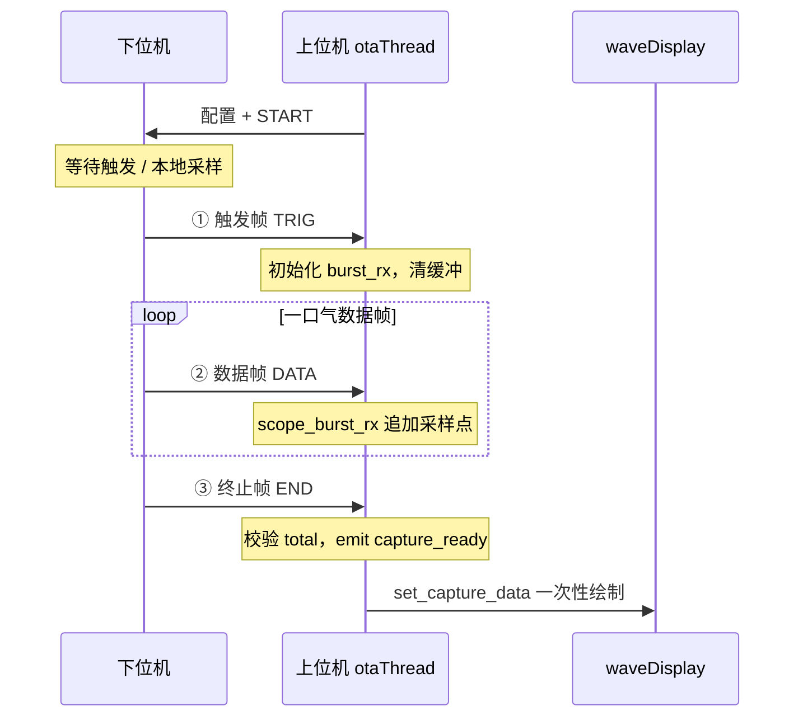
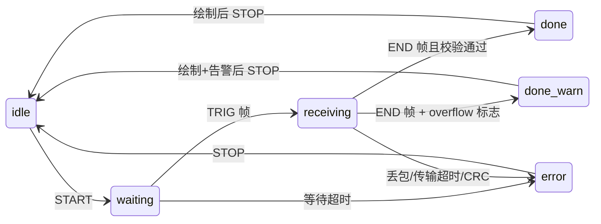

# 示波器触发模式（上位机侧）实现计划

## 协议模型

**下位机**：本地持续采样写入 RAM → 触发后将缓存**一口气**多帧上传。  
**上位机**：按三阶段组包，**收齐终止帧后**调用 `set_capture_data` 绘一次。



### 三阶段粗略格式（初版，后续可优化）

与现有**扫频上传**（`UART_FRAME_CUSTOME_DATA` 0x18，[`comPro_out_data`](D:/git project/rzt2l_motor_driver/src/UART_RECE_SEND.c)）同思路：多帧连续发、每帧带类型与 float 数组。触发模式在此基础上增加明确的**头尾语义**。

| 阶段 | 建议帧标识 | 粗略 payload（待定稿） | 上位机动作 |
|------|-----------|------------------------|------------|
| ① 触发 | `scope_type=TRIG` 或专用 subcmd | `sample_hz`, `ch_num`, `total_samples`, `trigger_tick`, `flags` | 清空 `capture_buf`，进入接收态 |
| ② 数据 | `scope_type=DATA` | `pack_idx`, `sample_cnt`, `[tick,u16][ch0..N]×cnt`（或扫频式 `len`+`float[]`） | `scope_burst_rx_append()` |
| ③ 终止 | `scope_type=END` | `actual_samples`, `status`（ok/overflow/timeout） | 校验 → `set_capture_data` 或报错 |

**实现策略：先粗后细**

- v0：复用 `PARA_UPDATE_START` (0x0A) 的 `errorCode` 区分 TRIG/DATA/END，数据段沿用扫频 `[len][float×N]` 形态，能跑通即可。
- v1：你方定稿后只改 `scope_parse_*` 映射表，不动状态机与 UI 骨架。

**可参考的扫频现有格式**（[`rxdPack_CUSTOME_DATA`](motor_tool/otaThread.cpp)）：

```
0x18 CUSTOME_DATA payload:
  [type:u8][len:u8][f0..f_{len-1}: float×len]
扫频 type=17：f[0]=频率索引, f[1]=幅值dB, f[2]=相角°
```

触发数据帧可类似：`type=SCOPE_DATA`, `len=3+`, 每点多个 float；或改为二进制紧凑格式（后续优化）。

---

## 命名规范

**本次新增**函数、变量、结构体成员统一 **简短 snake_case 语义名**；现有 camelCase 代码（`chEchoFreHz`、`waveDisplay` 等）不批量重命名。

| 用途 | 建议命名 |
|------|----------|
| 工作模式枚举 | `scope_mode_continuous` / `scope_mode_trigger` |
| 触发配置 | `scope_trig_cfg`（含 `sample_hz`, `buf_samples`, `timeout_ms`） |
| 组包接收器 | `scope_burst_rx` |
| 解析入口 | `scope_on_trig_frame()`, `scope_on_data_frame()`, `scope_on_end_frame()` |
| 捕获缓冲 | `capture_buf[CHANNAL_SEL_NUM]` |
| 状态 | `scope_rx_state`（idle / waiting / receiving / done / error） |
| 绘图 | `waveDisplay::set_capture_data()` |
| 完成信号 | `scope_capture_ready` |

---

## 现状与频率上限

| 环节 | 值 | 说明 |
|------|-----|------|
| 下位机采样上限 | ~10 kHz | CMTW0 10kHz，去掉 `%10` 分频后 |
| 连续模式（不变） | 1 kHz 流式 | 现有 `uart_para_updata` |
| UART 突发传完耗时 | ~90 KB/s | 不影响显示采样率，只影响等待时间 |
| 触发模式 UI 刷新 | **一次** | 不收 `WAVE_SHOW_FRE` 20Hz 路径 |

---

## 目标状态机



| 异常 | UI | 处理 |
|------|-----|------|
| 等待超时 | 「等待触发超时」 | `scope_rx_state=error`, STOP |
| 缓存截断 | 「数据已截断」黄色 | 仍 `set_capture_data` |
| 数据帧丢包 | 「传输不完整」 | `pack_idx` 跳变检测 |
| 收 END 超时 | 「接收超时」 | 中止，可选保留部分数据 |

---

## 上位机改动清单

### 1. [`otaThread.h` / `otaThread.cpp`](motor_tool/otaThread.h)

```cpp
// 新增（snake_case）
enum scope_rx_state { scope_rx_idle, scope_rx_waiting, scope_rx_receiving, scope_rx_done, scope_rx_error };

struct scope_trig_cfg {
    quint16 sample_hz;
    quint16 buf_samples;
    quint16 timeout_ms;
    // 触发条件字段后续扩展
};

struct scope_burst_rx {
    QVector<QCPGraphData> capture_buf[CHANNAL_SEL_NUM];
    quint16 expect_total;
    quint16 recv_total;
    quint16 last_pack_idx;
    bool    overflow;
    scope_rx_state state;
};
```

- 扩展 `rxdPack_PARA_UPDATE_START`（或新帧）：按 `errorCode`/subcmd 分发到 `scope_on_trig_frame` / `scope_on_data_frame` / `scope_on_end_frame`。
- 连续模式原路径**不变**；`scope_mode == scope_mode_trigger` 时走 burst 路径。
- 收齐 END → `emit scope_capture_ready(capture_buf)`；复用 `Burst_mode=1` 的 µs 时间戳解析。
- 激活 [`STEP_SCOPE_SET_MODE`](motor_tool/otaThread.cpp) 发送触发模式配置（协议 v0 可先占位）。

### 2. [`wavedisplay.h` / `wavedisplay.cpp`](motor_tool/wavedisplay.cpp)

```cpp
void set_capture_data(QVector<QCPGraphData> *buf, double trig_time = -1);
```

- 一次性 `dataContainer->set()` + `rescaleAxes()` + `replot()`。
- 固定 X 轴 `[t0, tN]`，不做 30s 滚动。
- `trig_time >= 0` 时画触发竖线（`QCPItemStraightLine`）。

### 3. [`mainwindow.cpp`](motor_tool/mainwindow.cpp)

- 模式选择：连续 / 触发突发。
- 状态 [`label_selChInfo`](motor_tool/mainwindow.cpp)：`等待触发` → `接收中 n/m` → `完成` / 异常。
- `scope_capture_ready` 槽：`waveShow->set_capture_data()`。

### 4. [`MOTOR_COMMUNICATION_PROTOCOL.md`](motor_tool/MOTOR_COMMUNICATION_PROTOCOL.md)

- 新增 §5.9.1：三阶段 TRIG/DATA/END，与扫频 0x18 格式对照表。
- 标注 v0 粗略 / v1 待优化字段。

---

## 与连续模式 / 扫频模式对比

| | 连续示波 | 触发突发（新） | 扫频（现有参考） |
|--|---------|---------------|-----------------|
| 帧类型 | 0x0A 流式 | TRIG+DATA+END | 0x18 多帧 float |
| 上位机 | `scope_dataProcess` 滚动 | `scope_burst_rx` 组包 | `rxdPack_CUSTOME_DATA` 文本 |
| 显示 | 20Hz `setData` | 一次 `set_capture_data` | 文本区，非波形 |
| 下位机 | 边采边传 | 缓存后一口气 | 扫频完再发 |

---

## 实施顺序

1. **协议 v0 对齐**（你方）：确认 TRIG/DATA/END 用 0x0A 扩展还是新 frame_id；数据帧是否先沿用 0x18 形态。
2. **上位机骨架**：`scope_burst_rx` + 三阶段解析桩 + snake_case API。
3. **`set_capture_data`** + 触发线。
4. **UI** 模式与进度。
5. **联调** → 你方细化协议后只改 `scope_parse_*`。

---

## 风险与约束

- 协议未定：先用 mock `capture_buf` 验证绘图与状态机。
- 单帧 126B 限制：数据帧须多点打包；与扫频逐点发类似但可加大 `len`。
- 大点数绘图：10k×8ch OpenGL 可接受；更深可后续加显示降采样。
